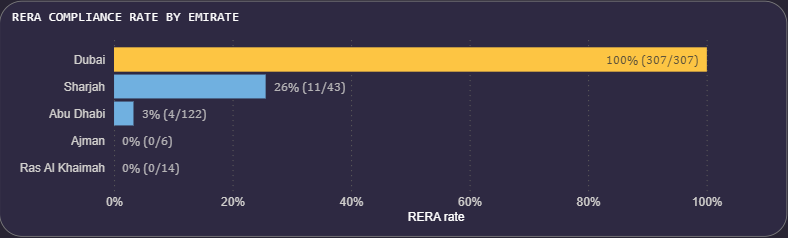
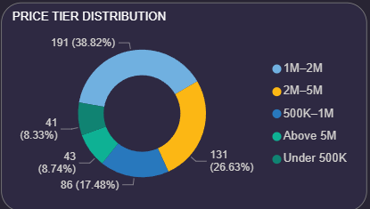

# UAE Property Market Analysis
### End-to-End Data Analytics Project | MySQL · Power BI · DAX


---

## Project Overview

This project builds a **property market intelligence pipeline** for the UAE residential real estate sector — starting from raw listing data, through a structured SQL transformation layer, and into a four-page Power BI dashboard designed to support pricing, compliance, area, and trend-based decisions.

The dataset covers **492 apartment sale listings** across 5 UAE emirates (Dubai, Abu Dhabi, Sharjah, Ras Al Khaimah, Ajman) spanning **June 2022 to March 2024**, with the bulk of activity concentrated in the high-activity window of **September 2023 to March 2024**.

This project was built to demonstrate an end-to-end analytical workflow applied to a domain that is directly relevant to UAE-based employers in real estate, PropTech, investment, and consulting — sectors where property data fluency is a core requirement.

> **Domain relevance:** The UAE property market is data-rich, investor-driven, and cross-emirate by nature — making it one of the most suitable domains for demonstrating market segmentation, regulatory analysis, and pricing intelligence using real-world data.

---

## Repository Structure

```
uae-property-analysis/
│
├── README.md                            ← You are here
│
├── sql/
│   ├── 01_data_inspection.sql           ← Raw table exploration and null audit
│   ├── 02_data_transformation.sql       ← Type casting, date parsing, RERA validation
│   ├── 03_data_cleaning.sql             ← Feature engineering and indexed clean table
│   └── 04_analytical_views.sql          ← Pre-aggregated view for Power BI 
│
├── assets/
│   ├── dashboard_page2_preview.png      ← Page 2 screenshot (RERA & Compliance)
│   ├── dashboard_page3_preview.png      ← Page 3 screenshot (Area Intelligence)
│   └── dashboard_page4_preview.png      ← Page 4 screenshot (Trends & Forecast)
│
├── docs/
│   ├── BUSINESS_INSIGHTS.md             ← Key findings, recommendations, investor personas
│   ├── DATA_DICTIONARY.md               ← Full field-level documentation
│   ├── page2_rera_compliance.md         ← All DAX measures for Page 2
│   ├── page3_area_intelligence.md       ← All DAX measures for Page 3
│   └── page4_trends_forecast.md         ← All DAX measures for Page 4
│
└── uae_properties.csv                   ← Source dataset (492 listings)
```

---

## Project Pipeline

```
Raw CSV → MySQL Ingestion → Type Transformation → Feature Engineering → Analytical Views → Power BI → Dashboards
```

| Stage | Tool | Output |
|---|---|---|
| Raw data ingestion | MySQL 8.0 | `uae_properties` table |
| Type casting & transformation | MySQL | `uae_properties_transform` |
| Data cleaning & feature engineering | MySQL | `uae_properties_clean` |
| Analytical aggregations | MySQL Views | 8 pre-aggregated views |
| Measures & calculated columns | DAX / Power BI | RERA status, compliance rate, price premium, area rank, trend metrics, forecast bands |
| Interactive dashboards | Power BI Desktop | 4-page report |

---

## Business Questions Addressed

**Pricing & Market Structure**
- How does average asking price vary across UAE emirates and neighbourhoods?
- What does price per bedroom reveal about affordability by location?
- Which price tier captures the largest share of buyer activity?

**Regulatory Compliance (RERA)**
- Which emirates show meaningful RERA registration levels, and which have near-zero compliance?
- Is there a statistically observable price difference between RERA-registered and unregistered listings in this dataset?
- Does compliance rate vary by bedroom type?

**Area Intelligence & Investment**
- Which areas combine high listing volume with above-market pricing?
- Which neighbourhoods offer the lowest price per bedroom within commutable distance of major business districts?
- How do areas segment across a premium/volume/value/emerging framework?

**Market Trends & Outlook**
- How did listing volume evolve from mid-2022 to early 2024?
- What does the Q1 2024 supply surge suggest about near-term price pressure?
- What does a simple 3-month moving average indicate about price direction, and what caveats apply to any forward-looking reading of this dataset?

---

## Key Findings

### Price Trend: Moderate Stabilisation After a September 2023 Peak

Average asking price reached its highest recorded point in September 2023 (AED 3,074,233) before declining and stabilising. By Q1 2024, the 3-month moving average had steadied around AED 2.07M–2.21M.

| Month | Avg Price (AED) | 3-Month MA (AED) | MoM Change |
|---|---|---|---|
| Sep 2023 | 3,074,233 | — | — |
| Oct 2023 | 2,426,500 | — | −21.1% |
| Nov 2023 | 2,306,822 | 2,602,518 | −4.9% |
| Dec 2023 | 1,772,180 | 2,168,501 | −23.2% |
| Jan 2024 | 2,322,319 | 2,133,774 | +31.0% |
| Feb 2024 | 2,103,554 | 2,066,017 | −9.4% |
| Mar 2024 | 2,191,178 | 2,205,684 | +4.2% |

**Interpretation (with appropriate caution):** The Sep 2023 peak coincides with a small sample (25 listings), many of them high-value Dubai properties — which inflates the average. The stabilisation in Q1 2024 is more statistically grounded given the larger sample (350 listings). **This is an indicative trend within this dataset and should not be read as a definitive market-wide price movement** without validation against a larger, independently sourced dataset.

---

### RERA Registration Shows a Notable Price Difference Within This Dataset

| Status | Listings | Avg Price (AED) |
|---|---|---|
| RERA Registered | 323 (65.7%) | 2,567,119 |
| Non-RERA | 169 (34.3%) | 1,400,794 |
| Difference | — | +AED 1,166,325 (+83%) |

This difference is notable, though it warrants a structural explanation: Dubai — which has 100% RERA compliance in this dataset — also has the highest average prices, so **the price gap is partly a city composition effect, not purely a compliance premium**. Isolating the RERA premium within Dubai alone would be a more rigorous test, but the dataset's homogeneous Dubai RERA structure makes that comparison unavailable here. The 83% figure is therefore presented as an **observed association, not a causal pricing premium**.

**RERA compliance by emirate:**

| Emirate | Compliance Rate | Note |
|---|---|---|
| Dubai | 100% | Mandated by DLD; all listings require RERA registration |
| Sharjah | 25.6% | Partial compliance; no universal mandate in this period |
| Abu Dhabi | 4.1% | Near-zero; Abu Dhabi operates under ADREC, not RERA |
| Ras Al Khaimah | 0.0% | No RERA framework in RAK during this period |
| Ajman | 0.0% | No RERA framework in Ajman during this period |


---

### Dubai Leads Supply; RAK Leads Average Price (With Caveats)

| Emirate | Listings | Avg Price (AED) | Median Price (AED) |
|---|---|---|---|
| Dubai | 307 (62.4%) | 2,587,409 | 1,800,630 |
| Abu Dhabi | 122 (24.8%) | 1,411,759 | 1,199,999 |
| Sharjah | 43 (8.7%) | 1,348,680 | 1,449,000 |
| Ras Al Khaimah | 14 (2.8%) | 2,812,817 | 3,300,000 |
| Ajman | 6 (1.2%) | 328,667 | 257,500 |

RAK's high average is driven by 10 Al Marjan Island listings in the premium segment — a small and concentrated sample that should not be treated as representative of the broader RAK market. The median (AED 3.3M) confirms this concentration.

---

### Price Tier Distribution Points to a Mid-Market Core

| Price Tier | Listings | Share |
|---|---|---|
| Under 500K | 41 | 8.3% |
| 500K – 1M | 86 | 17.5% |
| 1M – 2M | 191 | 38.8% |
| 2M – 5M | 131 | 26.6% |
| Above 5M | 43 | 8.7% |



The AED 1M–2M band accounts for the largest share of listings, consistent with Dubai's mid-market community developments (JVC, Town Square, Business Bay entry-level) and Abu Dhabi's Al Reem Island corridor.

---

### Best Value Areas by Price Per Bedroom

| Area | City | Avg Price/Bedroom (AED) | Listings |
|---|---|---|---|
| Emirates City | Ajman | 115,933 | 5 |
| Al Reef | Abu Dhabi | 344,444 | 3 |
| Al Shamkha | Abu Dhabi | 391,884 | 43 |
| Al Ghadeer | Abu Dhabi | 411,905 | 7 |
| Muwaileh | Sharjah | 478,524 | 14 |
| Al Reem Island | Abu Dhabi | 495,907 | 34 |
| Town Square | Dubai | 545,417 | 8 |
| Wasl Gate | Dubai | 558,333 | 6 |

Al Shamkha (Abu Dhabi) is the most analytically robust entry in this list — 43 listings provide a reasonably sized sample with a consistent sub-AED 400K per-bedroom average.

---

## Investor Persona Insights

These personas are illustrative frameworks derived from the data — not prescriptive financial advice.

### Budget Buyer (Under AED 800K)
**Profile:** First-time buyers, young professionals, or small-scale buy-to-let investors targeting tenant demand from middle-income workers.  
**Relevant areas in this dataset:** Emirates City (Ajman), Muwaileh (Sharjah), outer Abu Dhabi communities.  
**Consideration from data:** 8.3% of listings fall under AED 500K; 17.5% in the 500K–1M band. Combined, 25.8% of the market is accessible at this budget. These listings are predominantly in non-Dubai emirates where RERA compliance rates are low, which may affect financing options for international buyers.

---

### Mid-Market Buyer (AED 1M – 3M)
**Profile:** UAE residents, regional investors, or Golden Visa seekers targeting the AED 2M threshold for residency eligibility.  
**Relevant areas:** Business Bay, JVC, Town Square, Al Reem Island, Aljada (Sharjah).  
**Consideration from data:** 65.4% of all listings fall in the AED 1M–5M range. Business Bay offers the highest volume of premium mid-market listings (24 listings averaging AED 3.99M). The AED 2M price point has disproportionate demand concentration due to the Golden Visa qualifier — a structural demand driver that is visible in the price clustering around that threshold.

---

### Luxury Investor (AED 5M+)
**Profile:** High-net-worth individuals, institutional investors, or international buyers targeting branded residences and waterfront assets.  
**Relevant areas:** Palm Jumeirah (avg AED 9.1M), Dubai Harbour (AED 6.5M), JBR (AED 6.1M), Downtown Dubai (AED 5.6M).  
**Consideration from data:** 43 listings (8.7%) exceed AED 5M. All are in Dubai. Sample sizes in individual ultra-luxury areas are small (5–17 listings), so area-level averages should be treated as directional rather than definitive.

---

### Yield-Focused Investor
**Profile:** Investors prioritising rental yield over capital appreciation. Typically targets high-occupancy tenant corridors with lower entry prices.  
**Relevant areas:** Town Square, Wasl Gate, Al Reem Island, JVC.  
**Consideration from data:** This dataset contains sale prices only — rental yield cannot be directly calculated without a corresponding rental dataset. The value areas identified (lowest price per bedroom) are proxies for yield-friendly zones, but gross yield estimation would require cross-referencing with Bayut or Property Finder rental listings.

---

## Time Trend Summary

| Metric | Sep 2023 | Mar 2024 | Change |
|---|---|---|---|
| Monthly listings | 25 | 139 | +456% |
| Avg asking price | AED 3,074,233 | AED 2,191,178 | −28.7% |
| 3-month moving avg | — | AED 2,205,684 | Stable |
| 3BR avg price | AED 3,551,802 | AED 3,094,802 | −12.9% |
| Studio avg price | AED 567,000 | AED 679,346 | +19.8% |

**Directional reading:** 3BR prices declined as supply expanded, while studio prices showed a modest upward trend — a pattern consistent with growing demand from the workforce and investor segments at lower price points. This is an **indicative pattern within this dataset**, not a statistically validated market forecast.

---

## Technical Details

### MySQL Pipeline (4 files)

| File | Stage | Output |
|---|---|---|
| `01_data_inspection.sql` | Exploration | Raw table audit — nulls, types, distinct values |
| `02_data_transformation.sql` | Staging | `uae_properties_transform` — type-cast table |
| `03_data_cleaning.sql` | Engineering | `uae_properties_clean` — feature-rich analytical table |
| `04_analytical_views.sql` | Aggregation | 8 views for Power BI consumption |


##  Dataset

**File:** `uae_properties.csv` | **Rows:** 492 | **Columns:** 10  
**Period:** June 2022 – March 2024 | **Segment:** Apartments, buy transactions only

| Column | Type | Description |
|---|---|---|
| `id` | INT | Unique listing identifier |
| `title` | TEXT | Listing title as published |
| `displayAddress` | TEXT | Full address string (parsed for city and area) |
| `bathrooms` | INT | Number of bathrooms |
| `bedrooms` | INT | Number of bedrooms (0 = Studio) |
| `addedOn` | DATETIME | Listing publication timestamp (ISO 8601) |
| `type` | TEXT | Transaction type — all values: `buy` |
| `rera` | BIGINT | RERA registration number (NULL = unregistered) |
| `propertyType` | TEXT | Property classification — all values: `apartment` |
| `price` | BIGINT | Asking price in AED |

---

## ⚠️ Limitations

Transparency about dataset constraints is essential for accurate interpretation of these findings.

- **Dataset size:** 492 listings is a small sample relative to the UAE's overall transaction volume. Findings should be treated as indicative of patterns within this dataset rather than representative of the full market.
- **Single property type:** All listings are apartments (buy transactions only). Villas, townhouses, commercial properties, and rental listings are not represented. Conclusions should not be generalised beyond the residential apartment sale segment.
- **Bedroom distribution:** Only studios (0 BR) and 3-bedroom units appear in this extract. The absence of 1BR and 2BR listings is likely an artefact of the data source, not the market. This limits bedroom-level analysis to two segments.
- **Small samples by emirate:** RAK (14 listings) and Ajman (6 listings) do not provide sufficient sample sizes for robust emirate-level conclusions. Their metrics are directional only.
- **Q1 2024 concentration:** 71.2% of listings were added in January–March 2024. This introduces recency bias and limits the reliability of long-run trend analysis across the full June 2022–March 2024 window.
- **Asking price, not transacted price:** All prices reflect asking (listed) prices. Final agreed sale prices — which may differ, particularly at the luxury end — are not available in this dataset.
- **RERA price association:** The 83% price difference between RERA-registered and unregistered listings is partly a city composition effect (Dubai mandates 100% RERA and has the highest prices). It should not be read as a direct causal relationship without city-controlled analysis.
- **No rental data:** Yield calculations are not possible with this dataset. The "yield-focused investor" persona relies on price proxies rather than actual rental income data.
- **Static snapshot:** The dataset reflects a fixed window. It does not capture post-March 2024 market developments, including any effects of global interest rate changes, new project launches, or regulatory updates.

---

##  How to Reproduce

**Prerequisites:** MySQL 8.0+, Power BI Desktop (free download from Microsoft)

**Step 1 — Set up the database**
```sql
CREATE DATABASE uae_property_db;
USE uae_property_db;
-- Import uae_properties.csv using MySQL Workbench Table Data Import Wizard
```

**Step 2 — Run the SQL pipeline in order**
```bash
mysql -u root -p uae_property_db < sql/01_data_inspection.sql
mysql -u root -p uae_property_db < sql/02_data_transformation.sql
mysql -u root -p uae_property_db < sql/03_data_cleaning.sql
mysql -u root -p uae_property_db < sql/04_analytical_views.sql
```

**Step 3 — Connect Power BI**
- Get Data → MySQL Database → `localhost` / `uae_property_db`
- Import all 8 views + `uae_properties_clean`

**Step 4 — Add DAX measures**
- Start with the `rera_status` calculated column (Page 2 and Page 3 depend on it)
- Then add measures from `docs/page2_rera_compliance.md`, `docs/page3_area_intelligence.md`, and `docs/page4_trends_forecast.md`

---
##  About This Project

This project was built to demonstrate a complete data analytics workflow applied to a real-world UAE business problem — from structured SQL data engineering through to business-ready Power BI dashboards.

The UAE real estate market was chosen deliberately: it is one of the most data-rich, internationally visible, and analytically complex property markets in the world, with strong demand for data professionals who understand local regulatory frameworks (RERA), emirate-level market segmentation, and investment dynamics.

**Tools & Skills Demonstrated:**
- `MySQL 8.0` — DDL, DML, CTEs, window functions, string parsing, date handling
- `Power BI Desktop` — data modelling, DAX calculated columns, DAX measures, visual design
- `DAX` — CALCULATE, RANKX, TOPN, AVERAGEX, DIVIDE, SWITCH, FILTER patterns
- Data cleaning & feature engineering from raw real-world data
- Business storytelling through structured dashboard design


## Skills Demonstrated

| Skill Area | Specifics |
|---|---|
| SQL Data Engineering | DDL, DML, string parsing with SUBSTRING_INDEX, date handling with STR_TO_DATE, window functions (SUM OVER PARTITION), conditional CAST, multi-stage pipeline design |
| Power BI | Data modelling, relationship management, DAX calculated columns, DAX measures, conditional formatting, drill-through, time intelligence |
| DAX | CALCULATE, RANKX, TOPN, AVERAGEX, DIVIDE, SWITCH, FILTER, ALLEXCEPT, moving averages, forecast bands |
| Analytical Thinking | Market segmentation, regulatory analysis, investor persona framing, trend interpretation with appropriate caveats |
| Business Communication | Findings framed as decisions, not just observations; limitations disclosed; audience-aware language for UAE property market context |

---

## Contact

**JITHIN SREENILAYAM**
| Data Analyst | UAE Market Focus

[](https://www.linkedin.com/in/jithin-sreenilayam/)
[](link)

---

##  License

This project is released for educational and portfolio purposes.  
Dataset sourced from publicly available Kaggle Database.


---

*Built with MySQL 8.0 + Power BI Desktop · UAE Residential Property Market 2022–2024*
